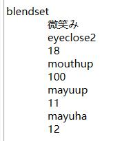

# 移植脸参考教程By流转的四季

注：四季老师提到要用 Blender 2.83 版本： [https://download.blender.org/release/](https://download.blender.org/release/)

四季老师使用的 Blender 2.83 的 CM3D2 Converter 转换插件是 2021.03.20b 这个版本：[https://github.com/luvoid/Blender-CM3D2-Converter/releases/tag/luv.2021.03.20](https://github.com/luvoid/Blender-CM3D2-Converter/releases/tag/luv.2021.03.20)

四季老师提供的参考脸模：[https://github.com/90135/COM3D2_Simple_MOD_Guide_Chinese/tree/main/%E7%B4%A0%E6%9D%90%E5%8C%85](https://github.com/90135/COM3D2_Simple_MOD_Guide_Chinese/tree/main/%E7%B4%A0%E6%9D%90%E5%8C%85)

四季老师的 QQ 群：201067330

## 提取官方FB脸

- 在捏人界面选中一个 FB 脸，同时按 M、O、D 三个键弹出左上角插件导出模型相关文件

  

  

- 将模型导入blender可以观察到人物的脸模分为前后两个部分，前面是 面部肌肤+眼睛+睫毛+眉毛+齿舌 等组成，后面是人物表情例如 脸红脸黑+眼泪+涎水 等组成
- 观察脸模的menu文件，有许多名为blendset的属性，其参数分别对应了移植脸不同表情，以及对应的形态键组合，可能不同的人导出后的blendset参数略有不同，我们统一将所有参数中的 * 号清除，（如eyeclose2* → eyeclose2），并将 eyeclose1 则全部改为 eyeclose（只改eyeclose1）

## 准备工作

- 对于待移植模型比如 MMD 模型、VRC模型等，导入blender后先通过材质分离将脸模部分单独分离出来，待移植脸自带的表情部分，可保留也可不保留，我们这里先默认保留。
- 导入FB脸，将材质属性中 Face001_FB_SkinAlpha 的部分分离出去，暂时不用，这部分就是前面提到的脸部后端表情
- 导入官方素体，将待移植脸模移动缩放，使之与脖子对齐，同时与 FB 脸尽可能贴合，优先保证对齐嘴巴的位置，会影响夜咖时部分姿势的效果，如果脸模与脖子之间有空隙，可以选中边缘顶点后按 E 键挤出略微调整
- 为了保证最终制作完成 mod 不同部位之间严密的衔接性，要将待移植模型的脸部、头发以及脸部饰品等一起移动缩放
- 推荐导入一个我个人制作的移植脸MOD进行参考学习

## 权重转移

们做的是移植脸。更多时候是为了还原而不是自定义捏人，所以有些部位例如耳朵鼻子我们一般不会调整，所以实际上并不需要完全按照官模的权重来转移，具体可以参考
**现有的移植脸 MOD**或者如下图所示，仅需保留如图几个顶点组即可

1. 左右眼瞳、高光(不包括眼白)的顶点组是 Eye_L 和 Eye_R，分离出来直接手刷，权重为 1
2. 左右眉毛的顶点组是 Mayupos_L、Mayupos_R，分离出来直接手刷，权重也为 1
3. 眼眶和眼白为 Eyepos_L 和Eyepos_R 顶点组，权重如图
4. Bone_Face 部分为脸部，权重可以理解为 Eyepos_R 和 Eyepos_L 权重取反，Nose 为空。

对于 3 和 4，权重我们并不手刷，而是把FB脸按材质分离保留对应部分，然后转移权重即可。(表情部分跟脸合并在一起转移权重)

## 转移材质球

选中 FB 脸，在编辑模式下，材质属性里按“选择”可以查看材质球对应的网格

这些材质球分别对应人物编辑界面的面部的各个部位

- 其中 Skin 最为重要，它会使该材质球影响的部位受到肤色调整时“无限色”(mugen)的影响，因此对于睫毛、眉毛、口齿等不应该受到影响地方，我们要区分出去。不过对于移植脸，我们一般不必区分这么细，后面再展开来讲

将FB脸和转移好权重的待移植模型都按材质分离，做第一步拆分，然后将待移植模型的材质球全部清空。

之后依次按照对应部位，例如左眼对左眼，右眼对右眼，眼白对眼白等等，将下图 FB 脸中的这些材质转移进待移植模型。

其中 fb_xxxx 是我们自定义的材质球，出于方便考虑，我们将 睫毛、眼皮、口腔、舌头、牙齿... 这些对于移植脸固定不变的材质归纳到一起。

类型选择：  

PS：所谓眼皮就是上睫毛靠上一点的一条细曲线，表现眼皮的凹痕处。

 

有的模型眼睛上会有一层半透明的“眼影”，我们通常会再新建一个自定义材质

类型选择： 

总之哪些部分是否合并，是否独立进一个材质球，都从实际需要出发

- 具体操作：先选中待移植模型，再 shift 加选 FB 脸的对应部位，在材质属性处选择“复制材质至选中”，如果待移植模型在第一步分离时不够细，比如左右眼是合并在一起的，我们就手动 Ctrl+L 分离成我们想要的结果
    - 
- 待移植模型自带的表情也按上述同理放入一个自定义材质球
- 也可以通过新建材质，在编辑模式下，选择对应网格指定至新材质，然后更改为为 COM3D2 材质，最后“复制材质”+"粘贴材质“
- 对于FB脸剩下的没用到的材质球，我们也要在最后复制进去(后续我们合并表情和脸模的时候会将 Face001_FB_SkinAlpha 材质球也合并进来)，并**保证最终顺序和上图一致**，这是因为许多 menu 文件对于脸部材质球的变更受到材质球序号影响

## 贴图替换

- 将我们用到的材质球的 _Maintex 和 _Shadowtex 替换成 MMD 对应的贴图即可，注意替换时的命名非常重要，后缀一定要是 _face007_skin_002.tex，（眉毛、眼睛、眼睛高光也可以不统一用一个贴图，而是另外命名，这样在同一个脸模进行不同眉毛色、瞳色、高光修改的时候比较好替换），其余没用到的保持默认
- Face001_FB_SkinAlpha 材质球也用默认的即可，但贴图的分辨率较低，推荐使用现有移植脸 MOD 的 xxxx_face006_skin_skinalpha.tex 贴图

## 形态键

- FB脸的表情形态键分为“前端表情”和“后端表情”，后端就是我们分离出去的 Face001_FB_SkinAlpha 部分对应的表情，其余为前端，我们分开来做，具体可以参考附录的 **前后端形态键对应参考**
- 首先参考前端的 FB 脸表情形态键，去制作待移植模型的表情形态键。尽可能还原 FB 脸的形态键，这样做是为了后续方便套用 FB 脸的表情参数，（不还原也没事，后续会在表情组合部分进一步调整）
- 对于待移植模型，我们要利用模型自带的表情形态键来进行制作，可以多利用下图中的混合新形变操作去生成一些新形态键
    - 
    - PS：一般MMD模型自带的表情形态键较少，有能力可以自行解包游戏内模型，其形态键会更丰富
- 在参考还原 FB 脸的形态键的过程中，有的FB脸例如GP脸形态键会比较丰富，eyeclose 部分其实不用分那么细，将后缀去掉每三个仅保留一个即可，命名为 eyeclose、eyeclose2...eyeclose8，对于 eyeedit 部分则全部跳过不做
- 然后制作后端表情，由于一些模型没有眼泪、涎水、脸红之类的，因此要将FB脸自带的后端表情部分合并给移植脸，即之前分离的 Face001_FB_SkinAlpha 部分，在合并之前，先对 holo*、tear*、namida、yodare、shock 形态键的位置进行调整：
- 1.holo*、tear* 要贴齐眼眶并稍微溢出一点
- 2.holo2、shock 要注意不要穿过前发，必要时可以细分增加弧度
- 3.holo2是整张脸潮红的表情，其中眼部部分不是红的而是透明的，因此要调节时要注意对齐模型眼眶的位置，后续可以在F6摄影插件中检查
- 4.holo*、tear*、namida 同时会受到eyeclose* 相关形态键的影响，yodare 则是会收到mouth* 相关的形态键的影响，因此想要精致制作，这一步也需额外针对脸模进行调整
- 最后， **在导出到游戏里时，若产生脸部光影随形态键移动、色调改变、边缘线偏移，抑或部分网格莫名随着畸变等等问题**，在导出设置里取消选择**Use Shape Key Colors**即可
  - 
- 若还不行，可以考虑换成 2.83 版本的 blender，将高版本 blender 中制作完后移植脸先导出为 model 文件，再用 2.83 导入后再导出即可
- 重新将前端表情做好的移植脸和 FB 脸导入 2.83 后，依旧分离 FB 脸的 Face001_FB_SkinAlpha 部分，对比移植脸，调整其形态键至合适位置，具体可以参考 **前后端形态键对应参考**，之后将二者的网格合并

### 前后端形态键对应参考

#### 前端表情(31个)

- (中间为一些MMD自带形态键可能对应的部分)
- eyebig——びっくり2——惊吓(眼睛微微睁大)
- eyeclose——まばたき——闭双眼(安然合上)
- eyeclose2——笑い——闭双眼(眯眼笑)
- eyeclose3——じと目——意味深长
- eyeclose5——ウィンク或ウィンク2——左闭眼(安然合上)
- eyeclose6——ウィンク或ウィンク2——左笑眯眼
- eyeclose7——ウィンク右或ウィンク2右——右闭眼(安然合上)
- eyeclose8——ウィンク右或ウィンク2右——右笑眯眼
- hitomih——瞳縦潰れ——失去高光
- hitomis——瞳小(推荐50%)——眼球皱缩
- mayueditin——真面目——认真眉（眉毛内侧向下）
- mayueditout——にこり——（眉毛外侧向下）
- mayuha——困る——为难、失落（八字眉）
- mayuup——上——(两眉毛)上扬
- mayuv——怒り——愤怒
- mayuvhalf——？——挑衅 (怒眉+半怒眉)
- mayuw——困る——痛苦、难受（W型双凹眉）
- moutha——あ，え——发出啊的口型
- mouthc——う或お——略微噘嘴的小圆口型（会跟疑问、接吻表情相关）
- mouthdw——口角下げ、ん、^等——悲伤、难过(嘴角向下)
- mouthfera——？——口交时候张大嘴
- mouthferar——？——口交张大嘴，右腮鼓起
- mouthhe——口角下げ、ん、^等——任性、赌气(嘴角向下)
- mouthi——い——呲牙
- mouths——？——控制笑容的嘴型
- mouthup——口角上げ——微笑(两边嘴角上扬)
- mouthuphalf——にやり２——左嘴角上挑(不张嘴)
- tangout——？——舌头伸出来
- tangup——？——舌尖上挑
- tangopen——？——舌后跟抬起(张嘴时舌头的变化)
- toothoff——歯無し上下——消除牙齿

- PS：舌头相关的推荐用FB脸的舌头进行形态键转移，并结合**形态键模糊**进行制作

#### 后端表情(16个)

- earelf（耳朵相关，不变不用管）
- earnone（耳朵相关，不变不用管）
- hoho（脸红相关，要注意尽量调整至贴合眼睛边缘，不然游戏内脸红的视觉表现会在眼睛下方陡然中断显得十分不自然，同时注意不要穿过头发）
- hoho2（脸红相关，注意事项同上）
- hohol（脸红相关，注意事项同上）
- hohos（脸红相关，注意事项同上）
- namida（泪珠）
- nosefook（不变不用管）
- shape（不变不用管）
- shapehohopushr（不变不用管）
- shapeslim（不变不用管）
- shock（这是震惊的表情，注意事项同脸红）
- tear1（流泪）
- tear2（流泪）
- tear3（流泪）
- yodare（涎水）

## 调整表情组合参数

- 在COM3D2中，有专门控制脸部表情的菜单(menu)文件，例如:
    - 
    - 可以看到，一个特定的表情是由多个形态键不同程度形变组合起来的，因此正确的制作顺序是调整menu菜单中的上图所示的*
      *Blendset List**。教程参考：[BlendsetEdit](https://github.com/trzr/Blender-CM3D2-BoneUtil/wiki/BlendsetEdit)
- 这样做的好处是我们可以在 blender 中直接查看和修改对应表情的展现效果而不用反复导入导出在游戏里检查，那样太不方便了。
- 因此，我们首先要复制一份 FB 脸的 menu 文件，改为我们自己的移植脸 menu，安装 BlendsetEdit 插件后在blender里导入 BlendsetList
- PS：blender 版本不能太新，以 2.8 为分界线之后的版本大概率会不兼容。推荐在 blender 2.83 中安装此插件。
- 导入方法一可以直接导入脸部的 menu 文件，方法二则是我们自行复制 menu 文件中 blendset 开头结构下的文本(其实直接全选复制即可，插件只会识别 blendset 的内容)，导出同理。调整的具体方法见图：
    - 
- 之后按照自己的喜好，或者仿照官方FB脸表情调整表情组合即可。特别注意：**写入 menu 文件 blendset 中的表情参数，即便不是上一节所列的 31+16 个形态键名，也可以生效，例如我可以让微笑表情由形态键 mouths(官方名称形态键) + hahahaha(自定义名称形态键) 组成，这也是可以正常生效的**

移植脸导入后要通过 F6 表情控制检查是否有问题，但前提是 model 不能有任何报错，需要上述基础形态键一个不能少(少了运行黑框里会报错提示)，此外移植脸任何部位的贴图读取也不能报错，否则都会影响F6的运行。

F6 插件中的每个选项都对应了一个形态键，这些基础形态键少一个都会报错，注意顶点组如果为空，导出时会自动删除，进入游戏还是报错，所以至少要移动一个顶点。

### **Blendset List** 对应翻译

#### 一般表情

- 通常——常态
- 微笑——Half Smile——（不张嘴）微笑
- 笑顔——Big Smile——（张嘴）灿烂的笑
- にっこり——Sweet Smile——（闭上眼不张嘴）甜甜的笑
- 優しさ——Gentle——温和
- 発情——Lust——发情
- ジト目——嫌弃厌恶的表情
- 閉じ目——Eyes Closed——静静闭眼
- 思案伏せ目——consideration——若有所思
- ドヤ顔——Proud——自豪脸
- 引きつり笑顔——Awkward Smile——尴尬的笑
- 苦笑い——Bitter Smile——苦笑
- 困った——Distressed——苦恼的神情
- 疑問——Curious——好奇
- ぷんすか——Upset——(淡淡的)难过
- むー——Mmmm..——（犹豫）emmm
- 泣き——Cry——（没眼泪更偏向委屈、泫然若泣）哭泣
- 拗ね——Sulk——闹别扭
- 照れ——Bashful——害羞
- 悲しみ2——Sad——(低落的神情)悲伤
- きょとん——Confused——（略带疑惑或惊讶）瞪眼
- びっくり——Surprised——惊讶、惊奇
- 少し怒り——Kinda Angry——(不开心)有点生气
- 怒り——Angry——生气
- 照れ叫び——Shout——呐喊状
- 誘惑——Temptation——诱惑
- 接吻——Kiss——（闭眼）接吻
- 居眠り安眠——Sleep——安然入睡
- まぶたギュ——Eyes Shut——（没睡醒努力睁眼状）眼睑弯曲
- まぶたギュ目を見開いて——Eyes Wide Open——睁大眼睛
- 痛みで目を見開いて——Eyes Open Pain——痛苦地睁大眼睛
- 恥ずかしい——Embarrassed——难为情
- ためいき——Sigh——感叹
- がっかり——扫兴
- 口開け——张嘴
- 目口閉じ——（闭目养神）闭上眼睛
- ウインク照れ——（左闭右睁地眨眼睛）抛媚眼（wink~）
- にっこり照れ——同にっこり，（闭眼闭嘴）甜甜的笑
-

#### **舞蹈表情**

- ダンス目つむり——（ダンス=dance）舞蹈闭目
- ダンスあくび——舞蹈哈欠
- ダンスびっくり——舞蹈惊奇
- ダンス微笑み——舞蹈微笑
- ダンス——舞蹈
- ダンス目とじ——舞蹈闭目
- ダンス誘惑——舞蹈诱惑
- ダンス困り顔——舞蹈窘迫
- ダンスウインク——舞蹈眨眼
- ダンス真剣——舞蹈认真（严肃）
- ダンス憂い——舞蹈忧愁
- ダンスジト目——舞蹈厌恶
- ダンスキス——舞蹈kiss

#### **涩涩表情**

- エロ通常１——general1——通常
- エロ通常２——general2
- エロ通常３——general3
- エロ興奮０——excitement1——兴奋
- エロ興奮１——excitement2
- エロ興奮２——excitement3
- エロ興奮３——excitement4
- エロ好感１——favourate1——喜欢
- エロ好感２——favourate2
- エロ好感３——favourate3
- エロ期待——anticipation——期待
- エロ羞恥１——bashful1——害羞
- エロ羞恥２——bashful2
- エロ羞恥３——bashful3
- エロ緊張——nervous——紧张
- エロ我慢１——endurance1——忍耐
- エロ我慢２——endurance2
- エロ我慢３——endurance3
- エロ嫌悪１——hate——讨厌
- エロ痛み１——pain1——疼痛
- エロ痛み２——pain2
- エロ痛み３——pain3
- エロ痛み我慢——enduring1——忍痛
- エロ痛み我慢２——enduring2
- エロ痛み我慢３——enduring3
- エロ怯え——afraid——害怕
- エロメソ泣き——lewd cry——淫泣（不包括眼泪，仅前端部分）
- あーん——Ahhnn——张口
- エロ舌責——吐舌
- エロ舌責嫌悪——Tongue Out Hate（吐舌厌恶脸）
- エロ舌責快楽——Tongue Out Pleasure（吐舌愉悦脸）
- エロ舐め通常——lick normal1——舔舐通常(舌头相关的2一般都是挑舌)
- エロ舐め通常２——lick normal2
- エロ舐め愛情——lick love1——舔舐爱情
- エロ舐め愛情２——lick love2
- エロ舐め快楽————lick pleasure1——舔舐快感
- エロ舐め快楽２————lick pleasure2
- エロ舐め嫌悪——lick hate1——舔舐厌恶(难受)
- エロ舐め嫌悪２——lick hate2
- エロフェラ通常——fellatio normal——口交通常
- エロフェラ愛情——fellatio love——口交爱情
- エロフェラ快楽——fellatio pleasure——口交快感
- エロフェラ嫌悪——fellatio hate——口交厌恶(难受)
- 閉じ舐め通常——lick normal1（close）——闭眼舔舐通常
- 閉じ舐め通常２——lick normal2（close）
- 閉じ舐め愛情——lick love1（close）——闭眼舔舐爱情
- 閉じ舐め愛情２——lick love2（close）
- 閉じ舐め快楽——lick pleasure1（close）——闭眼舔舐快感
- 閉じ舐め快楽２——lick pleasure2（close）
- 閉じ舐め嫌悪————lick hate1（close）闭眼舔舐厌恶(难受)
- 閉じ舐め嫌悪２————lick hate2（close）
- 閉じフェラ通常——fellatio normal(close)——闭眼口交通常
- 閉じフェラ愛情——fellatio love(close)
- 閉じフェラ快楽——fellatio pleasure(close)——闭眼口交快感
- 閉じフェラ嫌悪——fellatio hate(close)
- 通常射精後１——after ejaculation1——射精后（通常）
- 通常射精後２——after ejaculation2
- 絶頂射精後１——after ejaculation1（orgsm）——射精后（高潮）
- 絶頂射精後２——after ejaculation2（orgsm）
- 興奮射精後１——after ejaculation1（aroused）——射精后（起性欲的）
- 興奮射精後２——after ejaculation2（aroused）
- 余韻弱——Afterglow——高潮后（余韵）
- エロ絶頂——orgasm——高潮
- エロ放心——absent minded——失神（安心？)

#### **其他表情**(不用管)

- 追加よだれ——追加口水
- 頬 x 涙 x よだれ——脸红、眼泪、口水的组合
- デフォ——默认
- エラー——error——错误？？（menu里是100%holo2）
- n
- a
- i

- PS：还记得我们保留的待移植模型自带的表情吗？它们也是由形态键控制的，且最后可能还有许多其他没用到的形态键，尤其是VRC模型，他们虽然不是Com的基础形态键无法在场景中被自动调用。我们依然可以通过插件 **[Shapekey Master](https://github.com/krypto5863/COM3D2.ShapekeyMaster)** 进行调用
- 
- 但相对的，留有大量形态键会导致model文件体积急剧增大，并增加运行负担，因此多余形态键请酌情保留，若选择完全不要则文章开头提到的自带表情部分也可删除。

## 导出相关

- 移植脸的组成除了前后发主要由脸型、眉毛、眼睛、眼睛高光四部分组成
    - 

- 脸型
    - 脸型相关包含许多贴图，命名格式一定要是 xxxx_face007_skin_002.tex，后端表情部分贴图的后缀是 _face006_skin_skinalpha，后缀一点不能错否则游戏内贴图会读取错误！
        - 
    - ldark (偏黑肤色)、lwhite (偏白肤色)、sukumizu (死库水肤色) 对应游戏内皮肤不同的颜色选项，一般直接用原贴图即可，我们不做适配调整，mugen (无限色)则将原 Face 贴图导入 PS，图像 | 模式 | 灰度即可
        - 
    - PS：由于移植脸的脸部贴图通常会有比较丰富的细节，例如腮红、眼红眼线等妆点，直接用无限色皮肤效果会丢失细节，因此可以自行修改一款“皮肤”，将无限色 menu 中的 head 部分删除即可，形成只改变身体颜色而不影响移植脸的效果。
    - 一般移植脸还会做眉毛、眼睛、眼睛高光的菜单，方便有时替换差分，参考现有 MOD 类比即可。
        - 
        - 
        - 

## 一些进阶知识

对于一些精灵耳的脸模制作，若也想为其添加摇曳(yure)效果，将原模型对应的耳骨跟准心骨嫁接到脸模的 Bone_center 骨上，将除了准心骨之外的骨骼名称后缀加上 _yure_

然后将基准骨 Face6GP 的骨骼位置修改为如图所示，最后导出时选择“衔铁”导出即可

