# Chapter1

本节包含四部分，分别是准备插件、介绍mod的组成、认识menu与制作fb配件。

在制作过程中，需要以下插件，请按照每个插件的介绍放到对应的文件夹：

## 准备插件

**仓库注：相关和文件工具请到[仓库主页](github.com/MeidoPromotionAssociation/COM3D2_Simple_MOD_Guide_Chinese)下载**

Menu 编辑器；Mate 编辑器；Pmat 编辑器，其作者禁止非日本人使用，请使用 COM3D2 MOD EDITOR V2 替代（包括 TexTool-TexToPng 工具也可以由此工具替代），此工具可以打开所有 COM3D2 的 MOD 格式：[https://github.com/MeidoPromotionAssociation/COM3D2_MOD_EDITOR](https://github.com/MeidoPromotionAssociation/COM3D2_MOD_EDITOR)

SybarisArcEditor 在仓库主页的 English Modding Tools Pack 包中

总之所有工具都在仓库主页下载：[github.com/MeidoPromotionAssociation/COM3D2_Simple_MOD_Guide_Chinese](github.com/MeidoPromotionAssociation/COM3D2_Simple_MOD_Guide_Chinese)

部分文件在仓库/素材包下载：[https://github.com/MeidoPromotionAssociation/COM3D2_Simple_MOD_Guide_Chinese/tree/main/%E7%B4%A0%E6%9D%90%E5%8C%85](https://github.com/MeidoPromotionAssociation/COM3D2_Simple_MOD_Guide_Chinese/tree/main/%E7%B4%A0%E6%9D%90%E5%8C%85)

你可以在 ymk 老师的网盘下载到本文的 pdf 版本和 ymk 老师的 MOD：[https://drive.google.com/drive/folders/1o0k9QREGKRmVlEr5WZSNUvBd7773ulN-](https://drive.google.com/drive/folders/1o0k9QREGKRmVlEr5WZSNUvBd7773ulN-)

<br>
<br>
<br>

- **Blender-CM3D2-Converter**：这是一个 blender 插件，用以导出 com3d2 可以读取的模型与动作文件。下载地址：<https://github.com/luvoid/Blender-CM3D2-Converter/releases>

请安装对应版本的 blender 并安装此 blender 插件。

Blender下载地址: <https://download.blender.org/release/>

如何给blender安装插件请自行搜索。

- **SybarisArcEditor**：com3d2 的解包软件，放置于游戏根目录。

- **Menu编辑器；Mate编辑器；Pmat编辑器**：可以放置于任何地方，用来打开 menu；mate；pmat 的软件。

- **TexTool-TexToPng**：可以放置于任何地方，用来把 png/jpg 转换为 tex 贴图文件，或者把 tex 转换为 png。Tex 是 com3d2 原版唯一可读的贴图格式，所以制作 mod 的所有贴图都要转为 tex 文件。把 png/jpg 左键拖动到这个软件上就会自动转换为 tex。

- **DynBoneEdit**：放置于 Sybaris/ UnityInjector 文件夹下，用来制作摇曳骨的插件。

除了**Blender**本体与**Blender-CM3D2-Converter**外，其他插件均在附带的文件夹内。

## mod的组成

一个典型的mod由以下几个部分组成：

- **Menu**：菜单文件，也是所有mod必需的文件。
- **Model**：模型文件。
- **Tex**：贴图文件。

此外，mod还可能有一些其他文件实现进阶的效果：

- **Mate**：外置材质球。用来给model更换贴图。
- **Phy&col**：物理与碰撞文件。可以控制摇曳骨骼与碰撞效果。
- **Psk**：裙物理文件。本游戏裙子的骨骼有专门的物理与碰撞效果，用phy和col会导致穿模。
- **Pmat**：渲染优先级文件。控制材质贴图的优先级。
- **Anm**：动画文件：控制骨骼运动。

## 认识menu

首先尝试利用**SybarisArcEditor**插件解包一个 menu。双击打开**SybarisArcEditor**，输入 dress216_wear，选择 dress216_wear_i_.menu，右键另存为。接着找到这个文件，在打开方式中选择用**menu编辑器**打开。可以看到如下界面：

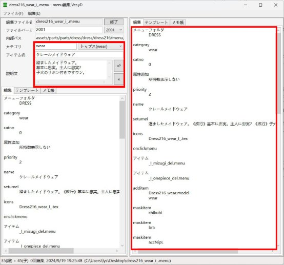

其中红框中为可编辑区域。请注意编辑区域内所有的缩进都是一个日文空格，左侧的三行分别为：

- **カテゴリ**：mod 的类别。也就是mod会在游戏中出现在哪个部位，例如上图中的 wear 代表上衣。本游戏的命名方式为英文+日文罗马音混用，完整的对照表见附带文件夹。
- **アイテム名**：mod 的名称。
- **説明文**：mod 的说明。

修改左侧的这三项，可以发现右侧对应的内容也会同步修改。

- **カテゴリ**=category
- **アイテム名**=name
- **説明文**=setumei

需要注意的是，在左侧修改，右侧的内容会自动同步，而在右侧修改，左侧的内容不会同步，因此这三项建议在左侧修改。另外 name 和 setumei 不要为空，否则在原版环境下会报错。

(仓库注：实际上左边的内容完全不会生效，在新版编辑器可以看到说明，只有右边的内容有用。)

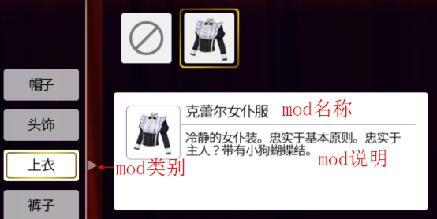

仓库注：在新版编辑器 COM3D2 MOD EDITOR V2 中，“左侧内容”被隐藏在文件头中，而“右侧内容”在下面的框中。

实际上可以在新版编辑器的帮助看到，“左侧内容” 是不会生效的，不要纠结该填什么，新版编辑器对所有参数都有说明（menu 命令补全），不知道该填什么时请参考。


接下来看 menu 右侧中的其他内容：

- **Priority**：填入阿拉伯数字。数字的大小决定了在游戏中这个mod出现的位置前后。数字越小，排序越靠前，可以为负数。（注：不建议为负数，游戏本身的删除菜单为0，负数会导致你找不到删除菜单（用于脱下当前部位））
- **Icons**：menu的图标。任何menu都需要有图标（部分特殊menu没有图标），图标是一个tex格式的贴图文件，把任意jpg/png格式的图片左键拖到**TexTool-TexToPng**上就可以转为tex格式。

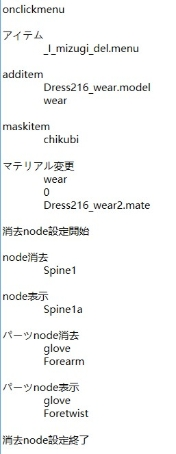

`Onclickmenu`上方的内容，是menu自身的属性。`Onclickmenu`下方的内容，就是在游戏中点击这个 menu 后，游戏会执行的指令。

（仓库注：实际上 Onclickmenu 只是一个视觉分隔符，没有任何实际作用）

在这个示例 menu 中，一共有五类命令：

`アイテム` 是一个连携命令，在执行这个命令后，会继续执行其他 menu 中的内容。多用于在游戏中脱下某个冲突部位的衣物。例如此处就是脱下了 mizugi（泳装）部位。

当然，这个命令也可以用来穿上某个部位的衣物。只要把**_I_mizugi_del.menu**改为你想连携的 menu 的名称。

```
 アイテム
    _I_mizugi_del.menu
```

`additem` 这一块是多数 menu 都会有的命令，意味着把某个模型文件（model）添加到身体的某个部位上，在游戏中就等于穿上了某件衣物。

```
additem
  Dress216_wear.model
  Wear
```

`maskitem` 是暂时遮蔽的指令，例如穿上外衣后要遮蔽内衣。当脱下外衣后，内衣就会重新显示。

```
maskitem
  chikubi
```

`マテリアル変更` 是用外置材质球替换贴图的指令，在以后谈及mate文件时会详细说明。此处的含义是，把wear栏的model的0号材质球，用外置的Dress216_wear2.mate材质球替换。常用于制作换色差分（差分公用一个model以节省空间），或是NPR材质。

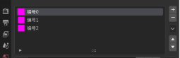

```
マテリアル変更
  wear
  0
  Dress216_wear2.mate
```

`Node消去` 是用来隐藏部分身体，防止穿模的命令。这里的部位名是com3d2素体骨架的骨骼名，需要在制作model的过程中了解，附带文件夹有一个简易的示例，来源com3d2 mod制作wiki：<https://seesaawiki.jp/com3d2mod_wiki/d/menu#content_1_21>

`パーツnode消去` 是隐藏部分其他衣物的命令，例如穿上衣服后，若是手套太长，可以把手套的前臂部分隐藏，仅留下手掌部分。

`node表示` 与 `パーツnode表示` 则是为了显示某个部分的指令。因为骨骼有父级关系，隐藏上臂会把连接上臂的所有子级（也就是整条手臂）都隐藏，通过`node表示`与`パーツnode表示`可以取消前臂或者手掌的隐藏。

以上是menu最常见的功能。不同的menu可以实现不同的功能，其他特殊的menu功能会在以后的章节中介绍。

在认识menu中的内容后，可以尝试制作一个脱下所有衣服，或者隐藏身体的mod（只需要一个menu和一个tex图标）。示例 mod 放在附带文件夹中。

## 无限色与固定色的menu

很容易注意到，例如头发、眼睛等部位除了可以选择固定的颜色，还可以通过调色板改为任意颜色。接下来以眼睛为例说明。

在游戏中同时在键盘上按住“M”、“O”、“D”三个键，游戏左上角会出现一个“ExportBase”按钮，点击后会弹窗告诉你当前选中的物品的名称，把得到的名称输入**SybarisArcEditor**插件的搜索栏，就可以解包出想要的官方文件。以eye_003为例，解包出以下三个文件：

- **_i_eye_003_folder.menu**
- **_i_eye_003_mugen.menu**
- **_i_eye_003_red.menu**

其中 folder 是眼睛的 menu，而 mugen 与 red 分别是无限色与固定色的 menu。打开 folder，其中的东西与上一小节的 menu 相比非常少，这是因为眼睛 mod 仅由 menu 与 tex 构成，不包括任何 model。

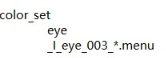

与上一小节的menu相比，folder多了一个控制颜色的属性。其中_I_eye_003_*.menu代表所有前缀包含 _I_eye_003_的 menu，可以把其中的星号看作任意字符，指向了多个瞳色menu文件，包括 _i_eye_003_mugen.menu和 _i_eye_003_red.menu。

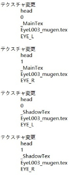重

命名这三个menu，例如改为：

- **Sample_folder.menu**
- **Sample_mugen.menu**
- **Sample_red.menu**

同时把 color\_set中的内容改为Sample\_\*.menu。瞳色的menu并不需要按照游戏中给的格式命名，只要前缀相同，后缀不同的任意瞳色menu都可以被识别。不过固定色menu的后缀可以取任意名字，但无限色menu的后缀必须为mugen。

接着打开瞳色的menu，把所有**テクスチャ変更**命令中的第四行的贴图替换为你想要眼睛贴图的名称后保存，瞳色menu就修改完了。

**テクスチャ変更**命令可以替换model中的贴图。因为眼睛mod不包含model，实际上是在替换头部model的贴图。与**マテリアル変更**命令一样，右图中的数字意味着头部model的第0号和第1号材质球。头部的第0号材质球为左眼，第1号为右眼，这四块指令分别是修改左眼的主贴图、修改右眼的主贴图、修改左眼的阴影贴图、修改右眼的阴影贴图。此外，还可以分别添加不同的贴图制作异形瞳或者异色瞳。

固定色和无限色的menu中的内容往往也有不同，右图截取自无限色的menu，比固定色的menu多了一行“EYE\_L”或者“EYE\_R”，请注意区别。

### 认识UVmap&制作Fb配件

除了eye（眼睛）与eye\_hi（瞳光）之外，大多数的fb脸配件都不是简单地把图像放在正中间就可以制作，这是因为每个fb配件的UVmap都不一样。UVmap可以在blender中查看，因为blender操作复杂，**本教程不涉及blender的基础操作**，请不熟悉blender的读者自行了解。

通过SybarisArcEditor解包出官方的fb脸型的model后，若正确安装了Blender-CM3D2-Converter插件，在左上角的文件——导入——CM3D2模型（.model）中导入这个model。

进入UV编辑模式，选中“Face001\_FB\_EyeLashesTop”材质球，就可以看到上睫毛的UVmap。2d的贴图通过某个映射方式，可以投影到3d的模型上，这种映射方式就是UVMap，简称UV。2d贴图与3d模型的关系，就像地图与地球仪的关系。只有照着UV画贴图，才能够正确的显示在3d模型上。你可以尝试用相同的方式查看fb脸的眼睛的UV，可以看到其UVmap恰好是包含了大部分画布的圆，因此制作眼睛的贴图才这么简单。

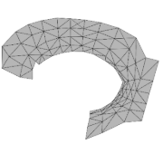

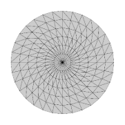


右图为上睫毛的UV与眼睛的UV。请导出上睫毛的UV布局图。

以上睫毛为例，制作fb配件mod，主要就是把各种奇形怪状的上睫毛改成和UV走势相似的图片。

下面以mmd模型为例制作，请先行安装能够导入mmd模型的blender插件。

首先把背景中的栅格透明度调为0，从mmd模型上分离出上睫毛。可以得到一张灰色背景的上睫毛图片。

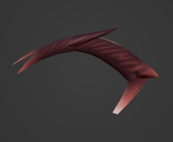

接着导出UV布局图，得到一张上睫毛的UVmap图片。打开任意绘图软件，去掉灰色的背景，改为一张透明背景的png图片。回到blender，添加一个正方形平面，为平面添加一个材质球。在材质属性的“CM3D2”中，把\_MainTex贴图替换为透明背景的上睫毛png。在材质属性的设置中，把混合模式从“不透明”改为“Alpha”。


同理，再添加一个平面，这次用上睫毛UVmap作为\_MainTex。在物体属性中，把其中一个z坐标值降低或者抬高，就能得到下侧图一的效果。选中上睫毛，进入编辑模式，不断地鼠标右键，选择细分，如下侧图二。再进入雕刻模式，选择弹性形变，把上睫毛的形状改为符合UV的走势。如下图三。

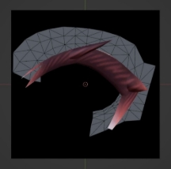
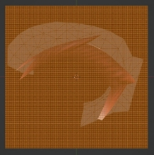
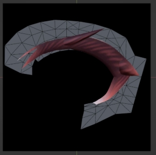

接着把其移动到没有坐标轴的位置，截图，在绘图软件中依靠UV对准位置，保存图片，就得到了一张符合UV走势的上睫毛贴图。这种方式适用于没有绘画基础的移植者，若你擅长绘画，也可以尝试直接按照UV绘制一张上睫毛贴图。

通过**SybarisArcEditor**，可以解包出一个原版上睫毛的menu，通过修改其中的参数，就可以得到新的上睫毛menu。一个fb上睫毛的mod就制作完成了。这个方法适用于睫毛、眉毛等拥有单独UV的fb配件。如果制作脸部纹身、嘴唇等使用脸部UV的配件，需要用烘培贴图等方式制作，会在第三章介绍。
