# Chapter2
在开始之前，请读者自行学习blender的基础操作。本教程无法涵盖所有blender的界面介绍、快捷键及其他诸多功能。在熟悉blender操作后，才建议继续看本教程。

## 制作头发model

本章开始需要处理model。model文件有五个要素：网格、骨架、顶点组（权重）、材质与形态键。其中前四项是任何model都需要的，而形态键是可选项。在制作头发的过程中，往往不需要处理形态键，因此在阅读本章前，请一定着重了解另外四个要素的含义。

处理model的主旨，就是在blender中，把要移植的物体移动+缩放到贴合官方素体的位置，然后修改材质球为com3d2的专用材质，刷上com3d2素体的权重，绑上com3d2可以识别的骨架，制作形态键，再导出。对于头发，则需要额外导出一个face001\_fb.model，保证头发可以贴合脸与脖子就可以了。Fbface需要靠**SybarisArcEditor**插件解包，而身体可以直接在物体模式中选择“添加——CM3D2——body001”。

在移植过程中，你可能会遇见如下常见报错：

↑网格没绑定父级骨架

↑网格的父级骨架无法识别（非COM3D2骨架）

↑网格中存在顶点无权重。

另外，model文件必须用特殊格式的材质球（shader，用来指定tex贴图，见下文）。如果报了这个错：

则说明你没有使用com3d2的专门的材质。模型导出时不能有com3d2专用材质以外的材质。

具体地说，头发移植有三种制作方式，权重转移、原骨骼移植与自建骨骼。现在大多数头发移植都推荐原骨骼移植，但是权重转移对移植衣服非常重要，所以首先介绍权重转移，让读者在移植头发的过程中熟悉一下。

### **权重转移**
把待移植网格移动到合适的位置，并贴合好头部后，先给待移植的头发添加com3d2材质球。

在材质属性中删除原有的材质，并“为com3d2创建新材料”或者直接“更改为COM3D2”。

如下图所示，有20种材质球可以选择。其中有两种是头发常用的，图标为梳子。左列第二个是没有轮廓线的头发材质球，左列第八个是有轮廓线的头发材质球。由于无限色默认会使用带轮廓线的材质球，所以一般推荐左列第八个，方便调节轮廓线的宽度。

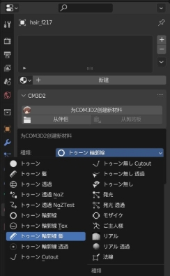

添加com3d2材质球后，在“cm3d2”这一栏中指定贴图，需要修改的地方有三个，分别是MainTex（主贴图）、ShadowTex（阴影贴图）和HiTex（高光贴图）。

在无插件环境下，头发的贴图有严格的命名规范，这是因为menu中会调用固定格式的贴图。

以无限色贴图为例，倘若你的头发model的命名为xxx\_hairf,model，则：

 - Maintex = xxx\_hairf\_mugen
 - Shadowtex = xxx\_hairf\_mugen\_shadow
 - Hitex = xxx\_hairf\_mugen\_s

给材质球指定贴图时，可以用png格式，在视图着色方式中可以看到贴图，游戏中会自动指向同名的tex格式贴图。材质球中其他参数暂时不动，会在本章后面介绍。

回到头发网格，在 “物体数据属性”中点击“顶点组”右侧**中间**的下三角图标，选择“删除全部顶点组。然后需要在游戏中找到一个形状类似的头发，并解包出来。

**点击解包头发，按住左shift键，再点击待移植的头发**，来到顶点组，同样点击刚才的图标，选择“空间模糊/重量转移”，按确认。如此一来就把官模头发的权重转移到了待移植的模型上。待移植的头发还需要骨架，**点击待移植的头发，按住左shift，再点击官模的骨架，鼠标右键，选择“父级——骨架形变”**。

这样一来，在本节提及的model的五个要素中，除了形态键之外，都已经完成了。头发一般不需要形态键。此时如果一切正常，已经可以导出model了。最后再做一些检查：点击骨骼，进入姿态模式，选择单段骨骼，按G（移动）或者R（旋转）单段骨骼，看看待移植的网格是否会跟着骨骼一起移动。检查完成后回到物体模式。

**在导出前，点击待移植的网格，按ctrl+A，选择“全部变换“**。在导出任何model之前均要做这一步，可以应用全部的位移旋转和缩放。

点击待移植网格在左上角选择“文件——导出——cm3d2模型”。在导出界面时有几个要注意的地方：**骨源一栏选择第四个**。右上角的model名改为与中间下侧同名，方便之后做摇曳文件。如果model名下方的基点骨不是“Auto”，请改为Auto，注意大小写。

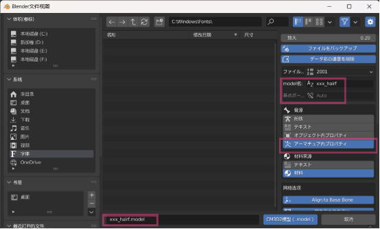

### 原骨骼移植

原骨骼移植适用于自带顶点组的网格，一般情况下还有与顶点组同名的骨骼，这往往需要你自行在编辑模式中，从完整模型截取头发的网格与骨骼。

材质球部分与上一节中一样，不再重复。处理后的网格与骨架如下图所示。

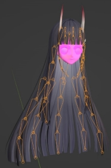

导入任意一个前发的model，删除其网格，只留下骨架。点击骨架进入编辑模式，把除了基准骨和根骨之外的所有骨骼选中并删除。在不熟悉头部骨骼时，可以选中骨架，在物体数据属性——视图显示栏中把骨骼的名称勾上，方便理解。在下图中，很多骨骼都有虚线连接着Hair\_F，这是它们的根骨，横着的这根“HairF217”就是基准骨。

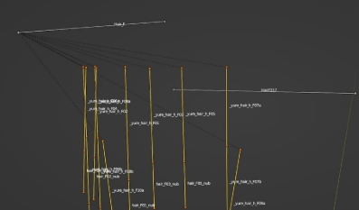

按del删除选择的黄色骨骼后，选中基准骨，在骨骼属性里，把变换栏的两个xyz值改为（0,0,0）和（1,0,0）这两个坐标分别是基准骨的头尾坐标。改完后可以看到基准骨躺在了原点。

回到物体模式，选择待移植骨架，按住左shift，再选择官模的骨架，右键合并。点击合并后的骨架，进入编辑模式，选择每一条骨骼根部的单段骨骼，在骨骼属性——关系——父级中，选择Hair\_F为父级。这样原骨骼就改造为了游戏可以识别的骨骼。

回到物体模式，点击网格，在左上角进入权重模式，在顶点组中点击不同的骨骼名可以看到该段骨骼控制的网格。在头发的权重中，可以看到如右图所示的控制发根部分的顶点组，把其名称改为Hair\_F。如此一来就可以导出了。在导出前不要忘了ctrl+A。

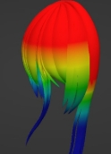

需要注意的是，导出时的界面中，**骨源需要选择第一个“衔骨”。对比导入时的骨骼，进行了任何的修改，都要选择第一个骨源导出。而不进行任何修改的，才可以用第四个骨源导出。**

在原骨骼移植过程中，最初筛选头发骨骼时，如果不小心漏选了一段，就有可能会产生报错。顶点组与骨骼的名称要一一对应，并且确保网格中的每个顶点都有权重才能够导出。这一点可以通过进入网格的编辑模式，在左上角的“选择——按特征全选——未归组顶点”检查是否有无权重顶点。

### 自建骨骼

长后发进行权重转移时，同一束头发可能会转移到两根骨骼上，这样在游戏中头发就会撕裂。当头发没有权重，且不适合权重转移时，就需要手动建骨骼与刷权重。制作骨骼与顶点组的方法与一般建模过程中相同，请自行了解。

除了骨骼与权重外，其余的操作都与原骨骼移植相同，不再赘述。

## 制作头发menu

头发的menu与chapter中展示的常规menu有所不同，还多出了以下几项：

**アタッチポイントの設定**——它控制了发饰等物件的位置。因为游戏中发饰等物件的位置是可以自由调控的，因此不用修改这部分。如果你想有一个相对自然的初始位置，可以用COM3D2.Atcc.Plugin.dll插件调整这个值。

**length**——它可以调整头发长度。把头发骨骼的名称填入第四行，就可以在游戏中通过小窗口的拉条修改这段骨骼的长度。如右图所示，这6行数字分别代表着最小长度、最小厚度、最小宽度、最大长度、最大厚度、最大宽度。当多个length模块的第二行有相同的名字（例：前发2），在游戏中就可以共用同一个滑条。

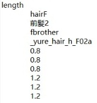

最后是在chapter1中已经见过的控制颜色的指令——color\_set。制作头发mod还需要发色menu，发色menu与瞳色menu一样，也分为固定色与无限色，但发色menu之间的差异远比瞳色大得多。

在固定色menu中，有两种新的命令：如下图，第一种是**color**命令，用来修改贴图的颜色。从上到下，这7行的含义分别是要修改的部位（hairF）的第0号材质球，把其主颜色的RGB值分别都修改为255，再把贴图的透明度改为255。

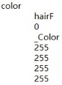

打开blender，在材质球中也能找到这个命令对应的部分。下图中的1就等价于menu中的255，可以按比例修改。除了\_Color外，固定色menu还可以修改影色（\_ShadowColor），边缘泛光（\_RimColor）和轮廓线的颜色（\_OutlineColor）。一般建议把固定色的边缘泛光都改为0，即黑色。

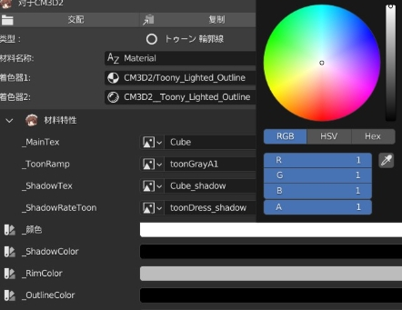

第二个指令是**テクスチャ変更**，这是更改贴图的命令。相信读者很容易就能看出，右边的指令代表着用\*\_black.tex贴图替换前发第0号材质球的主贴图，星号代表着model的名字，这也是为什么在上文中曾经对头发的贴图的命名规范提出过要求。

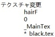

值得注意的是，这里的贴图名是可以修改替换的。把\*\_black.tex替换为固定的一张贴图，可以减少重复贴图，减少mod的大小。但是经过测试，无限色的mugen贴图无法用单张固定贴图替换，还请注意。

同样地，这个命令不止可以替换主帖图，还可以替换阴影贴图和toon。同样在上图的blender材质球有对应部分。

打开mugen发色，相比固定色，其中又多了两个新的命令。第一个是**shader**：

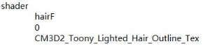

这个命令用来修改材质球着色器的种类。图中这一段把前发的0号材质球，更改为带轮廓线的材质。前文提及无限色默认会使用带轮廓线的材质球就是因为这个命令。

对照blender材质球中的着色器名称，可以替换为其他的材质，例如，若想让头发在无限色时也没有轮廓线，那么可以修改为CM3D2\_Toony\_Lighted\_Hair。

最后是**tex**命令。与**テクスチャ変更**基本相同。

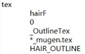

这些命令不止可以用于发色的menu，在任何menu中，都可以通过命令修改或替换贴图的材质与颜色，这些命令配合color\_set命令，可以在服装上也实现无限色。

## 多材质球

头发可以有多个材质球，但是无限色menu中的所有命令都是针对第0号材质球的。剩余的其他材质球依然是固定色，这可以用来制作发绳之类与头发紧密贴合的物体。

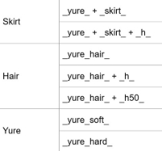

## 摇曳骨

摇曳骨的种类见右图：

在发骨（除了基准骨与根骨外的骨骼）的名称中加入“\_yure\_”的字段就可以被游戏识别为摇曳骨，但还需要用DynBoneEdit插件（游戏中按alt+F12打开）调整物理与碰撞。使用摇曳骨时，每根发骨的末尾建议多拉出一段空权重骨骼。

若是加入右侧的字段，则会多出游戏自封的摇曳与碰撞。因此对于头发，建议在发骨上加入“\_yure\_hair\_”的字段，h与h50分别是效果更“硬”的摇曳效果。

安装DynBoneEdit插件并打开后，可以看到如下图一样的界面。左侧的上部分可以调物理效果，下部分调碰撞效果。

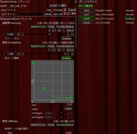

物理效果中，主要的四个参数是衰减率、弹性力、刚性和重力。

衰减率代表骨骼在摇动后回到原位的快慢，衰减率越大，头发根部对发尖的影响越小。而刚性刚好相反，数值越大，头发越硬。一般的长发都是把衰减率拉大，刚性拉小。

弹性力是对摇曳的抵抗，需要让根部的骨骼数值较大，然后快速降低，末端的数值较小。**下图中是以曲线的形式决定弹性力。但是调节后经常无法成功导出，需要点击“Partial”对每根骨骼进行单独设定**。在设定时，请保证根骨（例如Hair\_F）的值等于1。

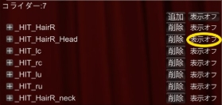

（仓库注：无法导出或有 BUG 时请配合 COM3D2 MOD EDITOR V2 使用，编辑器内也写了详细的参数含义 [https://github.com/90135/COM3D2_MOD_EDITOR](https://github.com/90135/COM3D2_MOD_EDITOR)）

以上的数值设定方法不是绝对的，例如纺锤形的头发就可以设置的完全相反。

默认的重力值是y=-0.01，这个效果过强了，建议改为-0.005。

接下来是碰撞效果。按一下图中黄色椭圆的部分就可以显示碰撞箱，头发的骨骼接触碰撞箱后会绕过而无法穿透。

设置完物理效果与碰撞效果后，回到最上方，可以修改col的名称，一般建议与phy的名称相同，而phy的名称是头发model导出时在右侧填写的model网格名（见本章第三页最上面的图）。把三个框都勾选后点击“Export”，phy文件与col文件就会在mod/ACC文件夹中生成。选中发骨后按Ctrl+F2可以一起添加摇曳字段。除了\_yure\_hair\_类的四种摇曳骨，一般用在衣服上，具体区别会在下一章中介绍。

## 常见问题

头发移植的介绍已经结束了。本节会介绍一些头发移植后可能会有的常见问题。

### 法向错误

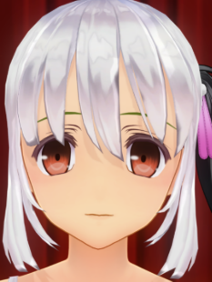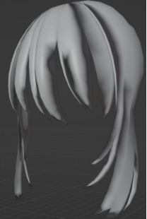

在某些时候可能会出现头发的某些区域有不自然的阴影，这是网格的法向出现了错误。在blender中进入编辑模式，全选后点击网格——法向——重置矢量后可以解决。

### 单侧透明

Com3d2的大多材质是单面的，单面模型在使用单面材质球后，会变得内侧透明，从侧面看会直接看到背景。

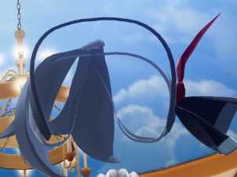

有四种处理方式：

1. 给网格添加修改器——实体化，这个方法不适用于有形态键的物体，不过头发一般没有形态键。但是衣服必须要做形态键，所以建议在制作形态键前就实体化。
2. 编辑模式下选中面后，在上边栏的“面——面实体化”中可以做到类似实体化修改器的效果，而且允许网格有形态键。
3. 编辑模式全选物体后shift+D复制一份，在左上角选择网格——法向——翻转。缺点是可能会导致无限色的阴影错误（下述）。
4. 一些材质球可以指定outlineTex贴图，使用这类材质球可以给内侧也指定贴图，不过有明显色差，可以考虑在blender或者menu中的color指令修改RGB值。

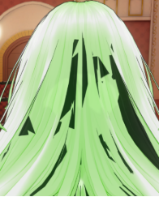

### 单侧黑色

这与单侧透明是同一问题，区别在于使用了轮廓线材质球。

### 无限色阴影错误

使用shift+D复制一份解决单侧透明问题，等价于多了一层背面向外的头发，当使用无限色时，menu会修改材质种类，使背面向外的那层头发的背面被视为非透明的轮廓线，两层非透明的重叠网格会导致阴影错误。

可以像前文介绍的那样，把mugen发色menu中修改材质的shader命令删除，或者修改为单侧透明的shader来避免阴影错误。

### 类推：移植帽子与头饰

帽子（acchat）与头饰（headset）的移植比头发更简单。这两个部位的根骨可以使用头发的根骨，除了在材质球中不选择头发的材质，而是选择这个：    

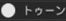

这个材质球是无轮廓线的单面透明材质球，也是制作衣物最常用的材质，其余过程都和移植头发一样，还不用考虑发色的menu。

