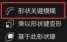
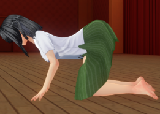
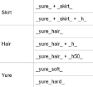

# **Chapter3**
本章介绍服装移植需注意的要点。

首先介绍一下服装骨骼的种类。大体上可以分为“通用骨骼”与“专有骨骼”。通用骨骼指的就是全身骨，就像下图中的两种素体，而一些特殊的部位无法识别全身骨，有专门的骨骼，例如上一章结尾的头饰与帽子可以用发骨。尤其要注意眼镜，眼罩，耳环，项链，项圈，尾巴这几个常用部位不能直接绑定素体的全身骨。显然，移植衣服时优先考虑放到通用骨骼的槽位会使移植更加方便。

**Tpose与Kpose**

左上角的“添加——CM3D2——身体001/姿势身体”可以导入上图中两种姿势的素体，下文中称为Tpose和Kpose。

常见的mmd模型一般是Tpose或者Apose（姿势与Tpose相似，双臂朝下）的。但是com3d2的默认姿势是Kpose，在T转K时，一些部位会严重穿模，涉及到肩膀、手肘、臀部、膝盖且无法node消去时，需要考虑用Kpose导出。

在制作服装前，推荐先导出Tpose与Kpose的anm姿态文件。通过导入anm文件可以让骨骼改变姿态，进入姿态模式后，在左上角的“姿态——应用——当前姿势的身体”可以固定当前的姿态。需要特别说明的是，固定姿态的功能常常报错，但是删去错误的骨骼后，可以发现网格已经成功改变了姿态，只需要再导入正确的骨骼重新绑定父级后就能继续移植。

**形态键**

与头发相同，制作衣物需要先调整网格贴合COM3D2的素体。请读者回顾上一章中介绍权重转移的部分。移植衣物时，常常转移素体或者形态相似的衣物的顶点组。但是比起头发，衣物还需要制作形态键。游戏中控制身体的拉条，大多是用骨骼控制的，但也有用形态键控制的，从导入素体中可以看到，有以下7个形态键：

arml——手臂粗细

hara——腹部隆起

munel——胸部大小（0以上）

munes——胸部大小（0以下）

munetare——胸部垂度

regfat——腿粗细

regmeet——腿粗细2

如果你的游戏没有装拓展拉条的插件，你的胸部大小在游戏中是无法调为负值的，那么munes形态键可以不用制作。一般紧贴胸部的衣物才需要考虑制作munes。

制作形态键的主旨，就是给衣物添加同名的形态键，形态键=0的衣服要贴合形态键=0的素体，形态键=1的衣服同时也要贴合形态键=1的素体，这样在游戏中拉条时，衣物就会随着身体同步变化。

需要特别注意的是，munetare形态键需要在munel=1的基础上，再制作这两个形态键，而非直接在素体的基础上制作。

按照权重转移相同的方式可以进行形态键转移，把素体或者衣物的形态键转移到要移植的衣物上。若待移植模型是巨乳，可以调整素体的形态键使其适应待移植模型，在形态键转移时勾选 “Bind to current source mix”可以生成贫乳的基型。

一般来说，直接转移形态键的效果较差，可以在转移后选中要修正的形态键，在形态键的右侧选择“形状关键模糊”，会进行一定程度的修正。

**胸部形态键**

胸部的形态键相比手臂、腹部、腿部的形态键更为复杂，因为其涉及胸部的顶点组。游戏中的胸部有一定的重力效果，若munel=1时身体的胸部权重与衣物的胸部权重相差过大，即使形态键调整好了也会穿模。

因此，我推荐在制作好胸部形态键后，把素体和衣服的胸部形态键设为基型，再进行权重转移。这样能保证巨乳时衣服与素体的形态键是同步的。再略微调整贫乳时的网格，就能保证二者的权重均保持一致，在游戏中便不会穿模。

形态键最大值=1等价于游戏内的胸部大小=100，在一些插件环境下，游戏内可以拉到200，这时可以通过修改形态键的范围上限，来保证超过100时胸部也不会穿模。另外，胸部也常用node消去隐藏。

权重转移的缺点是不同顶点组之间会有明显的边界，在胸部可能会导致下乳的部位不够平滑，此时可以考虑在权重绘制模式中，利用“模糊”与“涂抹”修改胸部相关的三个顶点组（Mune\_L\_sub、Mune\_R\_sub、Bip01 Spine1a）的边缘处的权重，使其过渡地更加平滑。

**官方裙骨**

裙子和头发一样，也有两种移植方式，继承权重移植和原骨骼移植。与头发相反，裙子更推荐继承权重移植。下图是二者的区别：

可以看到，原骨骼移植的碰撞效果非常差，但与之相对，因为可以自由调节phy，所以物理效果比原骨骼移植更好。对于裙子的配饰或者旗袍等需要摇曳效果，且几乎不与腿部接触的物件，推荐用原骨移植。在原骨移植时，只有父级为“skirt”的骨骼才可以随着臀部改变而改变。而默认的素体是没有“Skirt”骨的，需要导出一个官方裙子再删去裙子部分的骨骼进行嫁接。

继承权重移植的官方裙骨的碰撞和物理不受phy&col控制，而是由另一种psk后缀的文件控制。当裙子的骨骼满足一些特定的规则后，才可以通过DynBoneEdit插件调节psk。Psk可以调节裙子的半径与重力等效果。裙骨需要满足的四条规则如下：

1. 裙骨的数量为12~24根。
1. 每根裙骨的每节分别命名为：

   Skirt01\_A\_yure\_skirt\_（第1节）

   Skirt01\_B\_yure\_skirt\_（第2节）

   Skirt01\_C\_yure\_skirt\_（第3节）

   ……

   每根不同的裙骨之间的区别是“Skirt01”的部分不同，从01——12~24。

1. 每根裙骨的骨骼数量相同。
1. Blender中右上角的裙骨顺序按编号排列（见右图）。若顺序错误可以通过分离/重新合并骨骼调整顺序。

保证这四点，就可以把待移植的裙骨改为psk可读的类官方裙骨，这样的好处是可以保留原模型的裙部权重。不过通常而言，直接转移官模的权重然后绑定官模的骨骼更为方便。

**服饰的摇曳骨**

上一章中谈了头发的摇曳骨，还有4类摇曳骨没有说明。对比裙骨的骨骼命名规范可以发现，右图中的“Skirt”类摇曳骨其实就是官方裙骨。而另一种“Yure”类摇曳骨就是原骨骼移植可用的裙骨。

使用“Yure”类摇曳骨的方法在上一章中已经提过，只要在每段骨骼的名字中都加入“\_yure\_”字段就会被视为摇曳骨，但是还需要通过DynBoneEdit插件调整物理与碰撞。而使用“\_yure\_soft\_”和“\_yure\_hard\_”与“\_yure\_hair\_”一样，会带有自封的物理碰撞效果与重力效果。

“\_yure\_soft\_”的物理重力效果类似一长串珍珠链；而“\_yure\_hard\_”的效果类似厚重的和服振袖，可以按需求使用。与“Skirt”类只能用于裙子不同，“Yure”类可以用于任何部位。

但是，使用“\_yure\_”（不包括\_yure\_soft\_和\_yure\_hard\_）的时候要注意，游戏中只能识别单根摇曳骨的根骨骨骼，也就是说，如果你想在双臂上各做一根摇曳骨，只能选择分为两件，或者使用\_yure\_soft\_和\_yure\_hard\_，仅用\_yure\_是不行的。

\_yure\_并不会被自动识别为摇曳骨，需要先找一套phy&col，并修改为和model相同的网格名，才能被DynBoneEdit插件识别。

**官方模型改造**

当要移植的model质量非常差时，可以考虑只使用其贴图，而网格部分用官方模型或已有的模型进行改造，这种方法的好处是不用再处理顶点组与形态键。第一章中提到过，2d的贴图是通过UVmap投射到3d模型表面的。因此，有两种方法进行官方模型改造，分别是修改2d贴图（烘焙或投影）与修改UVmap。这三种方式并非com3d2的特殊技巧，因此本文只进行简短的介绍，同时会把介绍的视频网址放在下方。

这些方法涉及原模型与官方模型的合并，注意请在合并前保证UVmap的名称相同（物体数据属性——UV贴图），非同名的UVmap合并后，其中一张UV会缩小至一个点。

**烘焙贴图：**

<https://www.youtube.com/watch?v=uAwmN9sCwSA&t=1216s>

第三段开始。烘焙投影贴图的教程有很多，可以自行寻找其他教程，需注意要找烘焙转移贴图，而不是把节点烘焙为贴图的教程。

教程视频中是两个完全重合的网格，在com3d2移植过程中是不会出现这种情况的，所以在烘焙前，需要对待移植的网格缩裹。

缩裹是一种修改器，在右侧的修改器属性中，添加修改器，“形变”中可以找到缩裹修改器，然后指定官方模型的网格就可以了。缩裹修改器不能应用于有形态键的网格，在使用缩裹前需要删除待移植网格的形态键。

缩裹的质量在一定程度上也影响了烘焙的质量。当高模（网格的面更多）向低模（网格的面更少），或者网格的面相似时，缩裹效果会比较好，而低模向高模缩裹时质量较差。

此外，在烘焙开始前，看需求还可以重展UV。当面的面积在UVmap中过于密集时，烘焙的效果当然也会变得很差。烘焙完成后，能得到一张符合官方模型UV分布的新贴图。

简单的缩裹修改器会使网格变为平面，若你想要保留网格的厚度（通常是利用缩裹制作形态键时），可以参照这个视频：

<https://www.bilibili.com/video/BV1Xpw4efEC2>

任何贴身的衣物都可以尝试用缩裹+烘焙的方式制作。此外，缩裹修改器也可用以制作形态键与纹身。

在第一章中提到过可以用烘焙的方式进行纹身制作，因为纹身的UV与身体的UV相同，所以可以直接把想制作为纹身的贴图缩裹到com素体上，然后烘焙一张纹身贴图，烘焙得到的贴图与原本的贴图有一定的色差，还需要在绘画软件中进行调整。打开纹身的menu，可以看到纹身有两种合成形式，分别是Alpha（加法合成）和Multiply（乘法合成），区别为是否会体现肌肤底色的影响。

UV是不随着网格形态改变而改变的，因此Tpose比Kpose更适合制作纹身。纹身贴图往往只占了整个UV的很小一部分，所以纹身贴图的分辨率建议高一些，否则会很糊，可以使用4096\*4096。还需要注意的是，lobody的身体UV与官方素体不同，若想制作lobody的纹身，需要导入lobody的model。

**投影贴图：**

<https://www.bilibili.com/video/BV1GC4y1r7pT/>

投影贴图需要下载视频评论区置顶给出的blender插件。

前文提及，低模缩裹到高模时，往往效果很差，而用投影贴图的方式更优。其原理与烘焙贴图相同，因此不再赘述。

**修改UVmap:**

在UV编辑模式中，可以直接修改官方模型网格的UV，让UV反过来适应2d贴图，然后把待移植的贴图指定到材质中。

修改UV的难度与贴图的复杂程度相关，若贴图较为整齐（UV多为矩形），修改UV的工作量较小，才推荐使用这种方法。若贴图的平面空间利用率很高，形状较为复杂，则不推荐修改UV。

为了让官方模型网格的UV变得与贴图更接近，需要先**标记缝合边**。缝合边圈出来网格在UV重展时会单独成为一块，可以对照着待移植模型的网格和贴图，标记官方模型的缝合边，此时再重展UV，官模的UV就会变得与待移植模型形状相似，此时再进行修改UV，会减少很多工作量。

当然，如果你的贴图是纯粹的单色油漆桶贴图，就不用管UV了，直接指定到材质球就行。

**高跟鞋**

高跟鞋有两种做法，RV与HH。RV的鞋子有专门的RV体型，只需要对照着RV体型的model移植就可以了。本节主要介绍HH。

使用HighHeel的mod需要额外的COM3D2.HighHeel.dll插件。在默认的配置文件中，有13d、20d、27d、34d四种不同的高度，你可以在配置文件中自行增加。在附带文件夹中，我给了这四种高度的Tpose的anm。对于大多数鞋子，只要给素体导入这些anm并固定，再让鞋子的网格贴合脚部，如果是短靴，绑定素体的骨架后就可以导出了，如果是长靴，可以再重新导入Kpose导出。

在导出时，除了要选择第一个骨源之外，还需要注意hhmod有专门的命名规范。在导出时，网格的名字（而不是model的名字）需要改为hhmod\_13d\_xxx，13d可替换为其他高度，在游戏中，穿上HH高跟鞋时会自动根据配置文件和网格的名称改变脚腕的角度。

**导出选项**

把导出界面拉大，可以看到很多网格选项。接下来一一说明这些选项的作用。

**Align to Base Bone：**网格对齐基准骨。推荐勾选。

**四角面を三角面に：**把四角面转换为三角面。游戏中四角面渲染有问题。因此必须勾选。

**Split Sharp Edges：**拆分锐边。建议勾选。

**接空間情報出力：**计算并导出顶点切线。游戏中会自动计算，没必要勾选。

**Shape Key Threshold：**形态键阈值，任一顶点移动距离低于这个值时不记录。

**跳过不变的形状关键点：**不导出空形态键。

**导出形态键法线：**形态键包含单独的法线信息，游戏中使用形态键时光照效果会改变，建议取消勾选。

**Shape Key Normals Blend：**形态键法线混合。保证基型到形态键的法线能够平滑的过渡。若你开启了导出形态键法线，则建议勾选。

**Use Shape Key Colors：**形态键颜色。建议取消勾选。

**ウエイトの合計を1.0に：**每个顶点的权重和为1.0（归一化）。

**頂点グループ名をCM3D2用に変換：**把顶点组的名称转换为游戏能识别的名称。

**应用修饰符：**应用修改器。

**Tips**

服饰的具体移植内容已经讲完了，接下来这段会介绍一些需要注意的地方。

**acckubi（项链）与acckubiwa（颈饰）：**

在不添加额外骨骼的情况下，项链部位的物品是跟随着胸口动的，而颈饰是随着脖子移动的，需要注意区分。右图是脖子与身体不平行时二者的示意图：

**Tpose转Kpose产生的阴影：**

在制作完成后，上臂与小臂之间经常会出现一块阴影。

这是因为Kpose的关节处是弯曲的，在T转K的时候，这部分被“缩”进了model内侧，使游戏认为这一块区域是背光的阴影区域。

回到blender打开model，用雕刻模式的“光滑”笔刷就可以解决。

**Node消去与Cutout消去cc：**

Node消去在第一章中就已经介绍过了，本章再次提及只为了提醒读者：node消去在非透明衣物中经常使用，特别是胸部与关节穿模。

上面的三张图分别是消去手肘和膝盖的命令与示例，如果你制作的衣物在关节弯曲时出现穿模，可以考虑使用图中的命令。

Cutout消去cc是2.39中新加入的指令，它可以随意的隐藏身体的任何部位，算是比node消去更优的方法，但很可能不适用于老版本的游戏。若你打算公开分享制作的mod，这可能并不是个普适的方法。

命令如下：

Dress912\_wear\_mask.tex是起到遮罩功能的贴图，上面左图就是这个mask贴图，右图是身体的UVmap与这张mask的对照图。mask贴图仅有黑白二色，黑色部分对应的UV对应的皮肤就会不显示。

经测试，该指令目前无法对NPR皮肤生效。

**半脱：**

裙子、连衣裙等衣物可以仿照官方模型制作半脱。

这一部分命令就是要掀开裙子前面或后面时，会参照相应的menu。打开这两个menu，其结构也非常简单，就是把additem的model改成了卷起后的model。在blender中，可以对比这三个model。照着修改model就行了。

**其他：**

1、在转移权重时，有重叠的衣服（比如内外两件）推荐合在一起转移一次权重，使用相同的骨骼，再分开成两个mod，这样可以减少改变姿态时，衣物之间的穿模。

2、双层衣物的内外层权重不一致会导致穿模，尤其是使用带有轮廓线的材质球，请在顶点组与形态键全部制作完后再shift+d复制双层，并使内层的材质球为反面透明的材质。

3、鞋子一般不需要脚趾的权重。

4、游戏是依据路径与名称读取文件的，因此替换不改变路径与名称的mod文件可以直接替换，游戏内会热更新。而改变过路径与名称需要重新刷新mod。

5、常用的移植素材建议单独保存，例如fb脸，Tpose与Kpose的anm等。

6、即使使用了mate，也要保证model在blender材质内指定的贴图存在于mod文件夹。

7、服装的基准骨的位置不一定在原点，若用第一个骨源导出时，游戏中网格在竖直方向上有偏移，需要检查基准骨的位置。基准骨（basebone）是哪根可以在骨骼的物体数据属性——自定义属性中查看。

8、每个部位的顶点数上限为65535。

