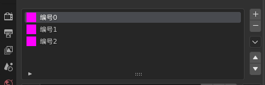
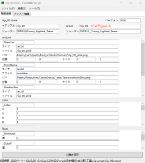

# **Chapter4**
本章主要介绍mate、pmat、anm、背景和移植脸。

**Mate**

前几章中已经多次提及，mate是外置的材质球。在menu中调用mate的命令如下：

第一行的wear是改变材质的槽位。

第二行的数字是材质球的编号，0代表第一个，以此类推：

第三行是mate的名称。

用mate编辑器打开一个mate，其中与blender内材质球的对应关系如下图：

左图红框中的pmat会在本章之后介绍，其余部分都是一一对应的。在左图的紫色标签页中，贴图名下的路径是不需要填的，游戏不会读取。

外置材质球的第一个作用是制作换色mod。因为每个model只能指定一组贴图，用mate的好处是每个换色只需要一个menu与一个mate，而model是共通的，可以降低mod的大小。

通过修改menu的名称，可以让多个menu如右图一样缩在一格。若第一个menu的名称为：

**xxx.menu**

其他的menu可以名为：

**xxx\_z1.menu**

**xxx\_z2.menu**

**……**

若你按照这样的格式改名后，多个menu并未缩在同一格，一般是因为你的menu名在“**xxx**”的部分中包含“**\_z**”，删掉这一部分就可以了。

外置材质球的第二个作用是非官方材质，例如NPR与liltoon，这两种外置材质都需要安装插件才能读取。

**NPR**

游戏中打开NPR插件，可以选择NPR效果。

只要把mate的名称加上NPR的后缀，就可以自动实现NPR效果，例如把xxx.mate改为xxx\_NPRMAT\_NPRToon\_CutoutAtC\_.mate。注意最后的下划线不要忘记。

NPR的详细介绍可以参见这个网址：

<https://github.com/Pain-Brioche/COM3D2-How-to/blob/master/Use_NPR.md>

网址中还有NPR的示例mod。我也放在附带文件夹中，建议读者逐一尝试，本文中只做极为简略的介绍。除了增强亮度之外，NPR材质增加了6类贴图与4类特殊着色器，分别是：

**MatcapMap：**matcap，实现反射效果。

**NormalMap：**法线贴图，实现凹凸效果。

**EmissionMap：**发光贴图，实现发光效果。

**RimLightMap：**边缘光贴图，实现边缘光效果。

**PBRMap：**PBR，实现物理渲染效果。

**ParallaxShaderToggle：**视差贴图，实现深度效果。

**Emissiv着色器：**支持发光效果的着色器，还可以制作简单的动画。

**Fabric着色器：**适用于布料材质的着色器，提供更好的布料质感。

**Reflection着色器：**实现实时反射效果的着色器。

**UnlitReflection着色器：**不受全局光照影响的反射着色器。

NPR的mate中有许多原版mate中没有的参数，建议在示例mod的基础上修改，而不要用原版的mate修改。

**Pmat**

Pmat是渲染优先级文件，也就是图层的显示顺序，下图为错误的渲染优先效果与应用了正确pmat后的显示效果：

在NPR插件中，可以看到一个名为RenderQueue的数值，简称RQ值。RQ值在0-5000之间，数值越大显示的优先度越高。例如上图就需要使胸罩的RQ值大于乳头的RQ值。

RQ值可以通过pmat文件控制，用pmat编辑器随便打开一个pmat（可以解包获得）。

Pmat需要配合mate使用。在pmat文件与对应的mate文件中分别填入文件名和RQ值就可以生效。建议使pmat文件名与mate文件名相同，就不用记哪里该填哪个文件名了。

或者你也可以选择下载插件**pmat\_extend.cs**放在scripts文件夹中，就可以直接在mate的pmat格子中填入数字，直接修改RQ值。当然，如果你要公开mod，则还是推荐制作pmat文件，以免未装插件的人读不出来。插件的下载地址为：

<https://github.com/silver1145/scripts-com3d2>

**anm动画**

游戏里的动画效果大多是通过anm文件控制骨骼的运动，因此，制作动画的目标就是在blender中制作骨骼的动画并导出为anm。

本次以旋转动画为例，把要旋转的部分单独绑一个骨骼。

在 blender顶部点击Animation或Layout，再进入骨骼的姿态模式。点击最下面的自动插针。

下面的坐标轴中，假设1s=60帧，一个周期2s=120帧。帧率可以在Layout的右侧边栏的“输出属性”中更改。

则需要拉到第0帧，30帧，60帧，90帧和120帧，分别插入（或自动生成）关键帧，转动0°、90°、180°、270°、360°。

点击空格就可以看到动画了，但是动画并不一定是匀速的。框选关键帧后右键，插值模式为线性，就会匀速转动了。一般来说，匀速转动用线性插值，贝塞尔插值在接近关键帧的时候会减速，类似翅膀的振动。

在导出anm时，还可以选择“再生速度”来控制骨骼动画的周期大小。导出后在menu中加入一段anime命令，loop代表循环，这样动画就做完了。

**背景**

背景移植一般有两种方法，做成移植物品mod和做成AssetBundle。

**做成移植物品：**

如果你已经熟练掌握上面的移植内容，相信第一种方式对你不是什么难事，和移植衣服其他部件没什么不同，只是把背景做成一件"衣服"而已，唯一需要注意的是游戏内单个物品有最大65535顶点数的限制，所以可能需要一个背景拆分到不同物品。

**做成AssetBundle：**

参考下面链接中的内容可以制作AssetBundle。

<https://github.com/Neerhom/COM3D2.ModLoader/wiki/Creating-.asset_bg-files>

该方法需求的ModLoader已经被MaidLoader完全替代，现在的插件包中一般都带有MaidLoader，若你缺少任何常见的插件，都可以用考虑用CMI安装，下载地址为：

<https://krypto5863.github.io/COM-Modular-Installer/download.html>

若你想要公开分发mod，推荐使用第一种方法。移植为物品的优势是社区更习惯这种方式，插件支持也更好，AssetBundle比较小众，如果以后游戏升级出现问题不一定有人及时修复。AssetBundle式的优势是有：

1. 移植更简单。
1. 可以使用unity内各种支持的shader，不受NPR限制。
1. 不受65535顶点数的限制。

AssetBundle的缺点是无法受第三方插件（例如SceneCapture）光源的影响。

**移植脸**

移植脸（固定脸）可以更好的还原模型的脸型，但是自由度较低。

Bender中打开素体，导入要移植的脸，移动到相对素体的合适位置。导入一个固定脸（例如face007.model），移到一边（骨骼不要移动），设置移植脸的父级骨骼为固定脸的骨骼。再进入固定脸的材质球页面，把所有的材质球复制到移植脸的材质处。

进入编辑模式，把移植脸的不同部分指定到不同的材质球中，从上到下分别为：

左眼；右眼；眼睛高光；眉毛；脸部alpha；脸部；嘴。脸部alpha就是藏在脸内部的红晕，表情等，常常为半透明材质，然后修改每个材质对应的贴图。复制完材质球后整个脸可能会变成黑色，没有关系，重新导出导入就好了。

然后制作顶点组，移植脸有6个顶点组，给移植脸对应的部分刷上权重。从上到下分别为：脸部；左眼；右眼；左眼周围；右眼周围；眉毛。其中Eyepos的两个控制眼眶周围的皮肤，对于追求还原的移植脸而言，很少有要调整眼间距的情况，基本没有必要制作。

请注意顶点组名称的大小写。大小写不一致是无法导出的。

最后是制作形态键。固定脸有37个基础形态键，我们要在移植脸中找到相对应的形态键，并修改为对应的名字。游戏中，缺少这37个形态键中的任意一个都会报错，如果没有对应的形态键，就自己制作一个（或者新建一个空的）。

完成表情形态键制作后就可以导出了。需注意若新建了空形态键，在导出时要取消勾选“跳过不变的形状关键点”，因为这个选项会自动删除空形态键。因为没有更改骨骼，选择第四个骨源导出。

接着是准备menu与tex。同样是靠解包得到固定脸的menu，在此基础上进行修改。blendset命令能组合各种形态键，可以尝试更改。利用BoneUtil插件，可以在物体数据属性中通过导入脸部的menu，预览形态键的组合效果并写入menu。BoneUtil下载地址为：<https://github.com/trzr/Blender-CM3D2-BoneUtil> 

需注意该插件于2019年停止维护，不保证blender2.9以后的版本可以使用该插件。

除了固定脸的menu，移植脸还需要准备眉毛、眼睛、眼睛高光的menu，同时，因为移植脸的UV与官方脸型有很大的差异，所以一般的脸部纹身、嘴唇等依靠脸部UV的贴图类mod也不适用。

在更改皮肤时，皮肤的menu中有命令会更改脸部的贴图，所以在修改皮肤后建议重新载入移植脸，或者修改皮肤menu相关的命令。

移植脸的tex与一般的mod不同，除了需要blender内指定的贴图，还需要额外的10张贴图（假设model的名字为Lzebul\_face.model）：

其中前四张贴图就是三种肤色和无限色的贴图，后面的是死库水泳装贴图，可通过解包获得。

**致谢**

非常感谢对我制作mod过程中提供过重要帮助的人：

Darkautumn、最后一次（fqq）、七星、无名、星辰（silveral）、祈り、Amitie√墨

非常感谢对本教程提出修改意见及解决方法的人：

雪刻、流转的四季、泠鸮、星辰（silveral）、无名、DaggerPuck、黑色天鹅

ymk

2025年2月
